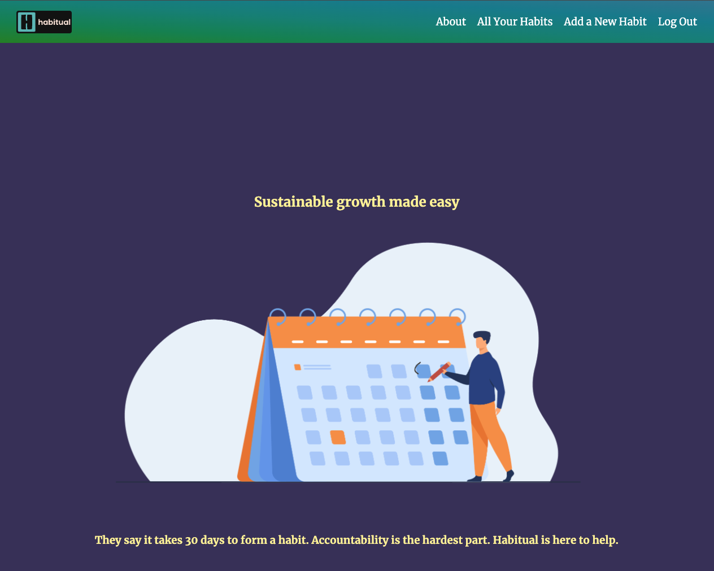

## Habitual

### [Go to Habitual!](https://habitual.fly.dev/)

Getting into new habits is hard. Often there's no one to be accountable to but yourself. In my own life, I have found that being accountable to someone or something keeps me on track. Maybe you're not practicing your sport enough. Or maybe you want to pick up a new hobby but are finding it difficult to add to your routine. Whatever the case, we've got you.

Habitual is a tracking app that takes you from inconsistency to certified habit in just 30 days. How can it improve your life?

### ✨ Features

- Create, Read, Update, and Delete habits of your choice using PostgreSQL. Add to your streak of days and see how many in a row you can get.
- Full implementation of Django's authentication and authorization so users can only see, edit and delete the habits they added

### 🧑‍💻 Technical Requirements:

- HTML
- CSS
- Django
- PostgreSQL
- Python
- Git/Github

### 📝 Planning Materials:

1. Wireframes and ERD created with [Whimsical](https://whimsical.com/)
2. Check out my [Trello Board](https://trello.com/b/Im3WKt3U/habitual) for this project

### 🙏 Attributions: 

1. Logo created using [My Free Logo Maker](https://myfreelogomaker.com/)
2. GitHub, LinkedIn and email icons from [freeicons.io](https://freeicons.io/)
3. Animations all from [lottiefiles.com](https://www.lottiefiles.com/)
4. Category icons from [flaticon.com](https://www.flaticon.com/)
  - [Buddy Icon](https://www.flaticon.com/free-icons/buddy) created by Freepik
  - [Running Icon](https://www.flaticon.com/free-icons/exercise) created by Freepik
  - [Fireplace Icon](https://www.flaticon.com/free-icons/furniture-and-household) created by Freepik
  - [Mountain Icon](https://www.flaticon.com/free-icons/mountain) created by Freepik
  - [Night Icon](https://www.flaticon.com/free-icons/mountain) created by Freepik
  - [Desert Icon](https://www.flaticon.com/free-icons/desert) created by Freepik
  - [Briefcase Icon](https://www.flaticon.com/free-icons/professions-and-jobs) created by Prosymbols Premium
5. Arrow icon made by gariebaldy from [Flat Icon](https://www.flaticon.com/free-icon/back_4467785?term=arrow+navigation&related_id=4467785)
5. Merriweather font from [Google Fonts](https://fonts.google.com/specimen/Merriweather)
6. Background mountain image from [svgbackground.com](https://www.svgbackgrounds.com/)

### 🧊 Icebox:

- Add a graphic showing a progress bar showing you how close a user is to achieving a certified habit
- Add ability to create checklists as a user to help break up habits into subgoals
- Add a profile and stat sheet for a user showing how many habits formed, longest streak, and any other pertinent stats.